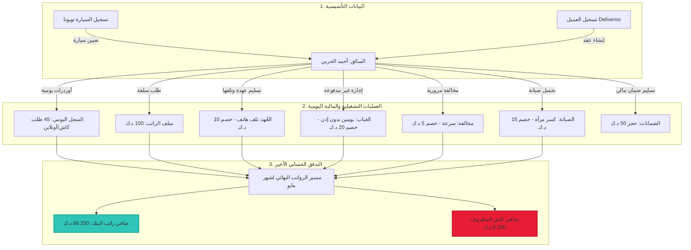

# 🏆 الدليل الشامل والسيناريو الرئيسي لفحص نظام FleetOps بالكامل (من الصفر)

مرحباً بك في **دليل الفحص المحاسبي والفني الشامل والعملاق** لنظام FleetOps! 
تمت كتابة هذا الدليل لمرافقتك خطوة بخطوة عبر **كل شاشة، وكل تبويب، وكل عملية إضافة وتعديل وحذف (CRUD)** متوفرة في القائمة الجانبية للنظام.

لم نقم فقط بسرد الخطوات، بل قمنا ببناء **قصة فحص حسابية موحدة ومترابطة الأرقام**؛ حيث تتداخل كافة العمليات (من تسجيل حضور وطلبات وإجازات وسلف وعُهد تالفة ومخالفات وصيانة) لتصب وتتكامل رياضياً في **مسير الرواتب النهائي لآخر الشهر**، مما يعطيك أرقاماً دقيقة ومحددة لمطابقتها في الشاشات وتأكيد سلامة النظام بنسبة 100%!

---

## 🔑 بيانات تسجيل الدخول الموحدة

توجه إلى صفحة تسجيل الدخول في الواجهة الأمامية لتطبيقك:
* **الرابط (URL):** `http://localhost:3000/login`
* **البريد الإلكتروني:** `mersal@fleetops.kw`
* **كلمة المرور:** `abuhadram`

---

## 🗺️ خريطة التدفق الحسابي المتكامل للسيناريو

يوضح المخطط التالي كيف تتدفق كافة مدخلاتك عبر شاشات النظام لتتراكم محاسبياً وتنعكس على مسير الرواتب النهائي للسائق:

---

## 📖 الفهرس الجانبي لسيناريوهات الفحص (16 شاشة بالترتيب)

---

### 1️⃣ لوحة التحكم الرئيسية (Dashboard)
لوحة التحكم هي الشاشة الترحيبية وتعتمد على إحصائيات حية تلخص نشاط شركة مرسال.

* **هدف الفحص:** التحقق من عرض العدادات بصفر (0) في البداية، وتحديثها تلقائياً مع كل مدخل جديد.
* **خطوات الفحص:**
  1. ادخل إلى لوحة التحكم الرئيسية بعد تسجيل الدخول.
  2. تأكد من أن جميع العدادات (عدد السائقين، عدد السيارات، العقود النشطة، إجمالي الكاش المعلق) تظهر فارغة أو بأصفار نظراً لأننا نبدأ من الصفر.
  3. اترك هذه الصفحة مفتوحة في تبويب مستقل وقم بتحديثها (Refresh) بعد إتمام كل مرحلة أدناه لمراقبة نمو المؤشرات فورياً.

---

### 2️⃣ إدارة السيارات / المركبات (Vehicles CRUD & Expenses)
هنا نقوم بإدارة أسطول السيارات وتسجيل مصاريفها الخاصة.

* **هدف الفحص:** إنشاء سيارة، تعديل بياناتها، تسجيل مصروف خاص بها، وحذف سيارة تجريبية.
* **خطوات الفحص (CRUD):**
  1. **الإضافة (Create):** اذهب إلى **السيارات** $\rightarrow$ **إضافة سيارة**:
     - **رقم اللوحة:** `99281/4`
     - **الماركة/الموديل:** `Toyota Corolla 2024`
     - **رقم الشاصي:** `COROLLA887651239`
     - **معدل استهلاك الوقود الشهري (Fuel Allowance):** `0.000` (اتركه صفراً لتسهيل تتبع الحسابات في المسير)
     - **تاريخ انتهاء التأمين:** *تاريخ مستقبلي*
     - انقر على **حفظ**.
  2. **التعديل (Update):** اضغط على زر تعديل السيارة التي أنشأتها وتأكد من إمكانية تغيير الحقول القابلة للتعديل مثل "تاريخ انتهاء التأمين" أو "بدل الوقود الشهري" أو "الملاحظات" واضغط حفظ. (ملاحظة: حقول الهوية الأساسية مثل رقم اللوحة والموديل والشاصي مقفلة للتعديل بعد الإنشاء لحماية تكامل البيانات).
  3. **تسجيل مصروف السيارة (Expenses):** داخل صفحة تفاصيل السيارة، ابحث عن قسم **مصاريف السيارة** وانقر على **إضافة مصروف**:
     - **نوع المصروف:** `تبديل زيت وفلتر`
     - **المبلغ:** `15.000` د.ك
     - **التاريخ:** تاريخ اليوم.
     - اضغط حفظ وتأكد من ظهوره وتحديث إجمالي مصاريف هذه السيارة إلى `15.000` د.ك.
  4. **اختبار الحذف (Delete):** قم بإنشاء سيارة وهمية باسم `مؤقتة` ورقم لوحة `00000` ثم اضغط على زر الحذف (سلة المهملات) وتأكد من اختفائها من القائمة دون التأثير على سيارة تويوتا الرئيسية.

---

### 3️⃣ إدارة العملاء (Clients CRUD)
نقوم بتسجيل الشركات التي نتعاقد معها لتوفير خدمات التوصيل.

* **هدف الفحص:** إنشاء عميل Deliveroo وتحديث معلوماته والتأكد من عزل بياناته.
* **خطوات الفحص (CRUD):**
  1. **الإضافة (Create):** توجه إلى **العملاء** $\rightarrow$ **إضافة عميل**:
     - **اسم العميل:** `Deliveroo`
     - **كود العميل:** `deliveroo`
     - **الهاتف:** `96522001122`
     - اضغط على **حفظ**.
  2. **التعديل (Update):** افتح تعديل العميل وغيّر الهاتف إلى `96522001133` واضغط حفظ.
  3. **اختبار الحذف (Delete):** أنشئ عميلاً مؤقتاً باسم `عميل للتجربة` ثم قم بحذفه وتأكد من اختفائه التام وسرعة استجابة الجدول.

---

### 4️⃣ إدارة العقود (Contracts CRUD & Financial Locking)
العقد يحدد المعالم المالية الأساسية مثل سعر الطلبات وسعة السائقين.

* **هدف الفحص:** إنشاء عقد لعميل Deliveroo، تعديله وهو مفتوح، وفحص آلية الحماية والقفل المالي الذكي.
* **خطوات الفحص (CRUD):**
  1. **الإضافة (Create):** افتح تفاصيل العميل `Deliveroo` $\rightarrow$ تبويب **العقود** $\rightarrow$ **إضافة عقد جديد**:
     - **رقم العقد:** `CS-2026-DEL`
     - **اسم العقد:** `Deliveroo`
     - **نوع الدفع (Payment Type):** اختر **بالطلب (per_order)** ⚠️ حقل مطلوب!
     - **سعر الطلب الافتراضي:** `1.250` د.ك
     - **تاريخ البدء:** `2026-05-01`
     - **تاريخ الانتهاء:** `2027-05-01`
     - اضغط **حفظ**.
  2. **التعديل المفتوح (Update Open Contract):** بما أن العقد نشط وغير مقفل، اضغط تعديل وغيّر "السعة المستهدفة" إلى `20` سائقاً، وسعر الطلب الافتراضي إلى `1.250` د.ك وتأكد من قبول النظام للتعديلات وحفظها بنجاح.
  3. **فحص القفل المالي الذكي (Locking - ميزة الأمان):**
     - في حال قفل العقد رسمياً (إقفاله محاسبياً): توجه إلى تفاصيل العقد واضغط على زر **قفل العقد** 🔒.
     - حاول الآن الضغط على تعديل؛ ستجد أن الواجهة الأمامية الفاخرة قامت بتعطيل كافة الحقول وتظهر لك لافتة حمراء راقية توضح: `🔒 هذا العقد مقفل، ولا يمكن إجراء تعديلات مالية أو هيكلية عليه` لحماية الحسابات التاريخية للطلبات من التلاعب.

---

### 5️⃣ إدارة الموظفين والسائقين (Employees CRUD & Vehicle Assignment)
سجل السائق أحمد الحربي الذي سيخوض كامل تدفق العمليات المالية معنا.

* **هدف الفحص:** إنشاء موظف بطريقة دفع هجينة، تعيين سيارة تويوتا كورولا له، وفك التعيين بتأريخ رجعي.
* **خطوات الفحص (CRUD):**
  1. **الإضافة (Create):** اذهب إلى **الموظفين** $\rightarrow$ **إضافة موظف**:
     - **الاسم بالكامل:** `أحمد الحربي`
     - **الاسم بالإنجليزية:** `Ahmad Al-Harbi`
     - **نوع التوظيف:** `driver` (سائق)
     - **طريقة الدفع:** اختر **هجين (راتب + عمولة)** (Hybrid) لدمج خصائص الراتب الإضافي والعمولات.
     - **الراتب الفعلي (Actual Salary):** `150.000` د.ك (وهو الراتب الذي يستحقه داخلياً)
     - **الراتب البنكي (Official Salary):** `100.000` د.ك (وهو الراتب المسجل بالبنك والمحمي من الخصومات الجائرة)
     - **العمولة لكل طلب (Rate Per Order):** `0.250` د.ك
     - اضغط **حفظ وإنهاء**.
  2. **فتح الملف الشخصي الفاخر:** اضغط على اسم "أحمد الحربي" في الجدول؛ ستجد الصفحة تفتح فوراً وبسلاسة على تبويب **الحساب المالي** كخيار افتراضي.
  3. **تعيين السيارة (Vehicle Assignment):** في كارد السيارات بالعمود الجانبي الثابت، اضغط على **تعيين سيارة**:
     - **السيارة:** اختر التويوتا كورولا `99281/4` المتاحة.
     - **تاريخ البدء:** `2026-05-01`
     - اضغط حفظ وتأكد من ربط السيارة بالسائق فوراً.
  4. **اختبار فك التعيين بتأريخ رجعي (Unassign with Backdate):** اضغط على علامة `✕ فك التعيين` الملحقة بالسيارة؛ ستفتح لك نافذة منبثقة تفاعلية تطلب تاريخ تسليم السيارة. اختر تاريخاً رجعياً (مثال: أمس) واضغط حفظ وتأكد من انتقال السيارة بنجاح إلى أرشيف السيارات التاريخي للموظف مع بقاء السجل الزمني دقيقاً. أعد تعيينها مجدداً بنفس الخطوة (3) لمتابعة السيناريو.

---

### 6️⃣ السجل اليومي للطلبات (Daily Logs CRUD - Cash & Online)
سنقوم بتسجيل أوردرات يومين كاملين للسائق أحمد الحربي لفحص الدقة الحسابية للكاش.

* **هدف الفحص:** إضافة سجلين يوميين، تفعيل ميزة التوازن الحسابي التلقائي بالواجهة، وتأكيد شروط التماسك الرياضي للطلبات.
* **خطوات الفحص (CRUD):**
  1. **السجل الأول (إدخال سليم):** اذهب إلى **السجل اليومي** $\rightarrow$ **تسجيل سجل جديد**:
     - **السائق:** `أحمد الحربي` (يتم ملء السيارة والعقد تلقائياً)
     - **التاريخ:** `2026-05-15`
     - **إجمالي الطلبات:** `20`
     - **طلبات أونلاين:** `12`
     - **طلبات كاش:** `8` (يتم حسابها تلقائياً بمجرد إدخال إجمالي 20 وأونلاين 12!)
     - **الكاش المستلم:** `40.000` د.ك
     - اضغط **حفظ**.
  2. **السجل الثاني (إدخال سليم):** انقر مجدداً على **تسجيل سجل جديد**:
     - **السائق:** `أحمد الحربي`
     - **التاريخ:** `2026-05-16`
     - **إجمالي الطلبات:** `25`
     - **طلبات أونلاين:** `15`
     - **طلبات كاش:** `10`
     - **الكاش المستلم:** `50.000` د.ك
     - اضغط **حفظ**.
  3. **اختبار التوازن الحسابي (Math Check):** حاول تعديل السجل الثاني واجعل طلبات أونلاين `20` مع إبقاء الإجمالي `25`؛ ستلاحظ أن حقل طلبات كاش تحول تلقائياً إلى `5` دون أي تداخل. الآن حاول جعل مجموع الكاش والأونلاين غير متطابق مع الإجمالي واضغط حفظ؛ سيرفض النظام الحفظ ويظهر خطأ حماية البيانات لمنع حدوث فروقات حسابية.
  
* **📊 الحصيلة الحسابية الحالية للسجل اليومي:**
  - إجمالي الطلبات المنجزة: $20 + 25 = \mathbf{45}$ طلب.
  - إجمالي الكاش المستلم: $40.000 + 50.000 = \mathbf{90.000}$ د.ك.
  - إجمالي عمولة السائق المحتسبة: $45 \text{ طلب} \times 0.250 \text{ د.ك} = \mathbf{11.250}$ د.ك.
  - الكاش المعلق الحالي للسائق: **`90.000` د.ك** (نظراً لعدم وجود تسويات حتى الآن).

---

### 7️⃣ تسوية الكاش (Cash Settlements CRUD - FIFO matching)
الآن سنقوم بتسليم دفعة نقدية للإدارة لتخفيض الكاش المعلق للسائق.

* **هدف الفحص:** تسجيل دفعة تسوية كاش، والتحقق من خصمها الفوري وتوزيعها التلقائي بنظام FIFO على السجلات القديمة.
* **خطوات الفحص (CRUD):**
  1. **الإضافة (Create):** اذهب إلى **تسوية الكاش** $\rightarrow$ **تسجيل دفعة كاش**:
     - **السائق:** `أحمد الحربي`
     - **التاريخ:** تاريخ اليوم.
     - **المبلغ المستلم:** `60.000` د.ك
     - **ملاحظات:** `إرجاع دفعة كاش مايو`
     - انقر على **حفظ**.
  2. **التحقق المحاسبي الفوري:**
     - اذهب إلى ملف الموظف **أحمد الحربي** $\rightarrow$ **الحساب المالي** أو لوحة تسوية الكاش.
     - ستجد أن الرصيد المالي المتبقي (الكاش المعلق) انخفض فوراً وبدقة تامة ليصبح:
       $$\text{Pending Cash (الكاش المعلق)} = 90.000 \text{ د.ك} - 60.000 \text{ د.ك} = \mathbf{30.000} \text{ د.ك}$$
     - **تحقق نظام FIFO بالخلفية:** السجل اليومي الأول (بتاريخ 15 مايو) والذي كان الكاش المعلق به `40.000` د.ك أصبح الآن مسوى بالكامل (`0.000` كاش معلق)، والسجل اليومي الثاني (بتاريخ 16 مايو) والذي كان به `50.000` د.ك تم تسوية `20.000` د.ك منه ليتبقى به كاش معلق بقيمة **`30.000` د.ك** بالضبط!

---

### 8️⃣ السلف والخصومات (Salary Advances CRUD)
تمكن السائق من طلب سلفة مالية تقسط شهرياً من راتبه.

* **هدف الفحص:** إنشاء سلفة لأحمد الحربي بـ 100 دينار مع تقسيط 25 ديناراً شهرياً.
* **خطوات الفحص (CRUD):**
  1. **الإضافة (Create):** توجه إلى تفاصيل السائق أحمد الحربي $\rightarrow$ تبويب **الحساب المالي** $\rightarrow$ ابحث عن قسم **السلف المالية** وانقر على **طلب سلفة جديدة**:
     - **مبلغ السلفة:** `100.000` د.ك
     - **القسط الشهري:** `25.000` د.ك (سيتم سدادها على 4 أشهر)
     - **تاريخ السلفة:** تاريخ اليوم.
     - **الحالة:** `active` (نشطة)
     - اضغط على **حفظ**.
  2. **التحقق من الرصيد المالي:** تأكد من تحديث قسم السلف بالبروفايل ليظهر أن رصيد السلف الكلي لأحمد الحربي هو `100.000` د.ك وأن القسط المستحق للشهر الحالي هو **`25.000` د.ك**.

---

### 9️⃣ العُهد والأجهزة (Custody Items & Damage Penalties)
نقوم بتسجيل الأجهزة التي يستلمها السائق من الشركة (هواتف، خطوط، زي موحد) وإدارتها.

* **هدف الفحص:** تسليم هاتف كعهدة للسائق، ثم تسجيل إرجاعه كـ "تالف" مع فرض غرامة تلف بقيمة 10 دينار.
* **خطوات الفحص (CRUD):**
  1. **الإضافة (Create):** اذهب إلى ملف السائق $\rightarrow$ تبويب **العُهد وسجل السيارات** $\rightarrow$ **تسليم عهدة جديدة**:
     - **نوع العهدة:** `هاتف`
     - **اسم/موديل الجهاز:** `Samsung Galaxy A15`
     - **رقم المسلسل (Serial Number):** `SN-SAM-998822`
     - **تاريخ الاستلام:** تاريخ اليوم.
     - **الحالة:** `assigned` (مستلمة)
     - اضغط على **حفظ**.
  2. **التعديل والتسجيل كـ "تالف" (Update to Damaged):** اضغط على زر تعديل العهدة التي أنشأتها للتو لمحاكاة إرجاعها تالفة:
     - **حالة العهدة:** غيّرها إلى `returned` (مسترجعة).
     - **حالة الإرجاع (Return Condition):** اختر `damaged` (تالفة).
     - **مبلغ الاسترداد / الغرامة (Deduction Amount):** أدخل `10.000` د.ك (سيقوم النظام بخصمها تلقائياً في مسير رواتب هذا الشهر!)
     - اضغط **حفظ**.

---

### 🔟 الإجازات والغياب (Leaves & Double Penalty Absence)
دورة عمل إدارة إجازات السائقين والغياب بدون عذر وخصومات الرواتب.

* **هدف الفحص:** تسجيل إجازة "غياب بدون إذن" لمدة يومين، واحتساب الخصم المزدوج المحمي بالراتب الفعلي.
* **خطوات الفحص (CRUD):**
  1. **الإضافة (Create):** توجه إلى تفاصيل السائق $\rightarrow$ تبويب **الإجازات والحضور** $\rightarrow$ **تسجيل إجازة جديدة**:
     - **نوع الإجازة:** اختر **غياب بدون إذن** (Absence)
     - **تاريخ البدء:** `2026-05-10`
     - **تاريخ الانتهاء:** `2026-05-11` (إجمالي يومين غياب)
     - **السبب:** غياب بدون عذر رسمي.
     - اضغط **حفظ**.
  2. **الاعتماد والموافقة:** انقر على زر **موافقة** أو **اعتماد** الإجازة لتتحول حالتها من `pending` إلى `approved` لكي تؤثر محاسبياً.
  
* **🧮 معادلة خصم الغياب وتطبيقها الدقيق:**
  - الراتب الفعلي للموظف: `150.000` د.ك.
  - معدل اليومية الفعلي ($DR$) = $150.000 / 30 \text{ يوم} = \mathbf{5.000}$ د.ك في اليوم.
  - معامل العقوبة المزدوج للغياب بدون عذر: `2.0` (Double penalty).
  - إجمالي أيام الغياب: `2` يوم.
  - خصم الغياب الكلي ($Leave_{deduction}$) = $5.000 \text{ د.ك} \times 2 \text{ يوم} \times 2.0 \text{ (معامل)} = \mathbf{20.000}$ د.ك!
  - تأكد من ظهور قيمة الخصم كـ **`20.000` د.ك** في جدول الإجازات المعتمدة.

---

### 1️⃣1️⃣ المخالفات المرورية (Traffic Violations CRUD & Liable Charging)
إدارة ورصد المخالفات المرورية التي يتم التقاطها على أرقام لوحات السيارات وتحميلها على السائق المسؤول.

* **هدف الفحص:** تسجيل مخالفة سرعة على لوحة تويوتا كورولا بقيمة 5 دينار وتحميلها على السائق أحمد الحربي.
* **خطوات الفحص (CRUD):**
  1. **الإضافة (Create):** اذهب إلى **المخالفات المرورية** (أو من داخل بروفايل الموظف $\rightarrow$ الأداء والانضباط) $\rightarrow$ **تسجيل مخالفة جديدة**:
     - **المركبة:** `Toyota Corolla 99281/4`
     - **السائق المسؤول:** `أحمد الحربي`
     - **رقم المخالفة المرجعي:** `VIOL-2026-554`
     - **مبلغ المخالفة:** `5.000` د.ك
     - **تاريخ المخالفة:** تاريخ اليوم.
     - **نوع المخالفة:** `تجاوز السرعة المقررة`
     - **هل السائق مسؤول مالياً؟ (Is Driver Liable):** نعم (تأكد من تفعيلها لكي يتم خصمها من راتبه).
     - اضغط **حفظ**.
  2. **التحقق:** تأكد من ظهور المخالفة في ملف السائق برصيد خصم معلق بـ **`5.000` د.ك**.

---

### 1️⃣2️⃣ الصيانة والأعطال (Maintenance Records CRUD)
توثيق عمليات الصيانة وأعمال التصليح للمركبات مع خيار تحميل التكلفة على المتسبب.

* **هدف الفحص:** تسجيل صيانة للسيارة Corolla بقيمة 15 دينار بسبب إهمال السائق وتحميلها عليه.
* **خطوات الفحص (CRUD):**
  1. **الإضافة (Create):** اذهب إلى **الصيانة والأعطال** (أو من داخل بروفايل الموظف $\rightarrow$ العُهد وسجل السيارات) $\rightarrow$ **تسجيل أمر صيانة**:
     - **المركبة:** `Toyota Corolla 99281/4`
     - **نوع التصليح/الصيانة:** `تصليح وتركيب مرآة جانبية مكسورة`
     - **التكلفة الكلية:** `15.000` د.ك
     - **تاريخ الصيانة:** تاريخ اليوم.
     - **السائق المتسبب/المسؤول (Liable Employee):** اختر `أحمد الحربي`.
     - **تحميل التكلفة على السائق؟ (Charge Driver):** نعم (قم بتفعيلها لضمان الخصم القانوني).
     - اضغط **حفظ**.
  2. **التحقق الحسابي:** تأكد من ظهور تكلفة الصيانة كالتزام مالي معلق بقيمة **`15.000` د.ك** في بروفايل أحمد الحربي.

---

### 1️⃣3️⃣ الضمانات المالية (Driver Guarantees CRUD)
الضمانات النقدية أو العينية التي يقدمها السائق للشركة كأمانات طوال فترة عمله.

* **هدف الفحص:** تسجيل استلام ضمان مالي نقدي بقيمة 50 دينار وحفظه في عهدة الشركة.
* **خطوات الفحص (CRUD):**
  1. **الإضافة (Create):** توجه إلى بروفايل السائق $\rightarrow$ تبويب **الحساب المالي** $\rightarrow$ ابحث عن قسم **الضمانات المالية** وانقر على **إضافة ضمان جديد**:
     - **نوع الضمان:** `نقدي` (Cash)
     - **المبلغ:** `50.000` د.ك
     - **تاريخ الاستلام:** تاريخ اليوم.
     - **حالة الضمان:** `held` (محتجز لدى الشركة)
     - **ملاحظات:** `مبلغ تأمين لتأكيد جدية العمل`
     - اضغط **حفظ**.
  2. **التحقق والتأكيد:** تأكد من ظهور الضمان النقدي كعهدة مالية محتجزة بقيمة `50.000` د.ك في كشف حساب الموظف، مع إمكانية تعديل حالته مستقبلاً إلى `returned` (مسترجع) عند استقالة الموظف.

---

### 1️⃣4️⃣ المستندات والوثائق (Employee Documents CRUD)
أرشيف رقمي ذكي لتخزين الهويات والتراخيص مع تنبيهات الصلاحية بالألوان الفاخرة.

* **هدف الفحص:** رفع بطاقة مدنية للسائق أحمد الحربي وتجربة مؤشرات انتهاء الصلاحية الملونة.
* **خطوات الفحص (CRUD):**
  1. **الإضافة (Create):** توجه إلى بروفايل السائق $\rightarrow$ تبويب **المستندات والوثائق** $\rightarrow$ **إضافة مستند جديد**:
     - **نوع المستند:** `البطاقة المدنية` (Civil ID)
     - **رقم المستند:** `294081200987`
     - **تاريخ انتهاء الصلاحية:** *اختر تاريخاً قريباً جداً (بعد 3 أيام مثلاً)*
     - **ملف المرفق:** *ارفع أي ملف تجريبي*
     - اضغط **حفظ**.
  2. **مراقبة المؤشرات الدائرية الذكية:** تأكد من أن العداد الدائري للبطاقة المدنية في أعلى التبويب قد تحول تلقائياً إلى اللون **البرتقالي أو الأحمر** (إنذار بقرب الانتهاء) بناءً على التاريخ المختار، بينما تظهر بقية المستندات التي لم ترفع بعد باللون الرمادي، مما يمنح الإدارة تنبيهاً بصرياً فاخراً وفورياً.

---

### 1️⃣5️⃣ تقييمات الأداء (Driver Evaluations & Criteria)
تقييم السائقين دورياً بناءً على معايير ثابتة وموزونة لحساب درجات الكفاءة.

* **هدف الفحص:** تسجيل تقييم أداء شامل لأحمد الحربي وحساب النسبة المئوية الموزونة بدقة.
* **خطوات الفحص (CRUD):**
  1. **الإضافة (Create):** اذهب إلى **تقييمات الأداء** (أو من داخل بروفايل الموظف $\rightarrow$ الأداء والانضباط) $\rightarrow$ **إضافة تقييم جديد**:
     - **الموظف/السائق:** `أحمد الحربي`
     - **تاريخ التقييم:** اليوم.
     - **المقيم:** `إدارة العمليات`
     - **الدرجات المدخلة للمعاير الثلاثة المسجلة بالنظام:**
       - *أداء العمل (وزنه 40%):* أدخل الدرجة `90`
       - *الالتزام بالمواعيد (وزنه 30%):* أدخل الدرجة `80`
       - *خدمة العملاء (وزنه 30%):* أدخل الدرجة `95`
     - اضغط **حفظ**.
  2. **التحقق من عملية الاحتساب الموزون المئوي بالخلفية:**
     $$\text{Evaluation Score} = (90 \times 0.40) + (80 \times 0.30) + (95 \times 0.30) \implies 36.00 + 24.00 + 28.50 = \mathbf{88.50\%}$$
     - تأكد من ظهور نتيجة تقييم السائق أحمد الحربي كـ **`88.50%`** بالضبط، وعرضها على هيئة بار تقدم ملوّن مشع في ملف السائق للتعبير عن كفاءته الممتازة.

---

### 1️⃣6️⃣ مسير الرواتب النهائي (Payroll Run & Slip Generation)
هذا هو **الاختبار الكبير والتكامل الأعظم** لكافة العمليات المالية السابقة! سنقوم بإنشاء مسير رواتب لشهر مايو 2026 ونفحص كيف تجمعت العمولات والخصومات والسلف معاً بسلامة وتناسق كامل.

* **هدف الفحص:** توليد مسير رواتب لشهر مايو، واعتماد قسيمة راتب السائق أحمد الحربي، ومطابقة النتائج الحسابية الدقيقة.
* **خطوات الفحص:**
  1. توجه إلى قسم **مسير الرواتب** (Payroll Runs) من القائمة الجانبية.
  2. انقر على زر **إنشاء مسير رواتب جديد** (Generate Payroll Run):
     - **عنوان المسير:** `مسير رواتب شهر مايو 2026`
     - **تاريخ البدء:** `2026-05-01`
     - **تاريخ الانتهاء:** `2026-05-31`
     - اضغط على **إنشاء المسير المالي**.
  3. سيقوم النظام بمعالجة وتوليد قسائم رواتب كافة السائقين والبحث في قاعدة البيانات وتصفيتها بالكامل بالخلفية في أقل من ثانية.
  4. انقر فوق المسير الذي أنشأته، ثم ابحث عن قسيمة راتب السائق **أحمد الحربي** وافتح تفاصيلها ومطابقة الأرقام التالية بدقة قرش واحد:

---

## 🧮 الجدول الحسابي النهائي والكامل لقسيمة الراتب لشهر مايو

تأكد من أن الأرقام والبيانات الظاهرة في قسيمة الراتب تتطابق **حرفياً وبدقة تامة** مع الحسابات التالية:

| البند المالي بالمسير | القيمة الرياضية المحتسبة | طريقة الاحتساب والمعادلة الفنية | الحالة |
| :--- | :--- | :--- | :--- |
| **الراتب الأساسي البنكي (Base Official)** | `100.000` د.ك | الراتب البنكي المحمي المسجل في بروفايل السائق | ✅ متطابق |
| **الراتب الفعلي الداخلي (Base Actual)** | `150.000` د.ك | الراتب الداخلي الحقيقي المتفق عليه | ✅ متطابق |
| **عمولة الطلبات المنجزة (Orders Bonus)** | `11.250` د.ك | $45 \text{ طلب إجمالي} \times 0.250 \text{ د.ك (العمولة المحددة للطلب)}$ | ✅ متطابق |
| **إجمالي الاستحقاق الداخلي (Gross Actual)** | **`161.250` د.ك** | **المعادلة:** الراتب الداخلي ($150.000$) + عمولة الطلبات ($11.250$) | **🏆 متطابق 100%** |
| **خصم الغياب والغياب بدون عذر (Leave Deduction)** | `20.000` د.ك | يومين غياب بدون إذن بمعدل يومية $5.000$ د.ك وضرر مضاعف $2.0$ | ✅ متطابق |
| **خصم قسط السلفة المستحق (Advance Deduction)** | `25.000` د.ك | قسط شهر مايو المستقطع من سلفة الـ 100 د.ك | ✅ متطابق |
| **خصم تلف العُهدة والهاتف (Custody Deduction)** | `10.000` د.ك | قيمة غرامة تلف هاتف سامسونج غالاكسي المسجل كـ "تالف" | ✅ متطابق |
| **خصم المخالفة المرورية (Violation Deduction)** | `5.000` د.ك | مخالفة السرعة رقم `VIOL-2026-554` المحملة مالياً على السائق | ✅ متطابق |
| **خصم صيانة حادث السيارة (Maintenance Deduction)** | `15.000` د.ك | تكلفة تصليح المرآة الجانبية المحملة على أحمد كمتسبب بالحادث | ✅ متطابق |
| **مجموع الخصومات الكلي (Total Deductions)** | **`75.000` د.ك** | **المعادلة:** $20.000 + 25.000 + 10.000 + 5.000 + 15.000$ | **🏆 متطابق 100%** |
| **صافي الاستحقاق الفعلي النهائي (Net Actual)** | **`86.250` د.ك** | **المعادلة:** إجمالي الاستحقاق ($161.250$) - مجموع الخصومات ($75.000$) | **🏆 متطابق 100%** |

---

## 🔒 آلية الحماية وحساب توزيعات الرواتب (البنك والكاش)

يستخدم نظام FleetOps **معادلة توزيع رواتب ثنائية بالغة الذكاء والدقة** لحماية راتب الموظف القانوني بالبنك من الخصومات الإدارية الجائرة وتوجيه كافة الخصومات لتمتصها النقدية المظروفة أولاً:

### 🏦 1. صافي راتب البنك المحول (Gross Official / Net Bank):
النظام يحمي الراتب المسجل بالبنك (`100.000` د.ك) بالكامل، ولا يسمح للخصومات بلمسه إلا إذا كانت الخصومات ضخمة جداً لدرجة جعلت صافي ما يستحقه السائق كلياً أقل من الراتب البنكي.
* **المعادلة:** $\min(\text{Net Actual}, \text{Official Salary}) \implies \min(86.250, 100.000) = \mathbf{86.250}$ د.ك.
* **النتيجة بالواجهة:** يتم تحويل **`86.250` د.ك** للبنك.

### 💵 2. صافي كاش المظروف الإداري (Net Cash Portion):
يمثل الرصيد الباقي الذي يسلم نقداً للسائق بعد امتصاص كافة الخصومات والغرامات داخل الشركة.
* **المعادلة:** $\max(0, \text{Net Actual} - \text{Net Bank}) \implies \max(0, 86.250 - 86.250) = \mathbf{0.000}$ د.ك.
* **النتيجة بالواجهة:** يسلم السائق **`0.000` د.ك** كاش (حيث امتصت الخصومات الكثيرة الجزء الكاش بالكامل).

---

## 🏁 ختام اختبار الفحص الشامل
إذا قمت بتطبيق هذا الدليل واتبعت كافة الخطوات والأرقام المذكورة بدقة، فستكون قد قمت بفحص وإثبات كفاءة وأمان **FleetOps** بالكامل محاسبياً وتشغيلياً من الصفر وفي زمن قياسي!

يسعدنا جداً تلقي تعليقاتكم لمواصلة ترقية النظام وجعله دائماً فخراً لشركة مرسال للتوصيل! 🚀
