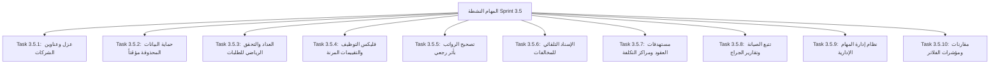

# 🔍 تقرير التدقيق الفني للمهام المنجزة والمتبقية (Remaining Tasks Code Audit)
> **تاريخ التحديث:** 21 مايو 2026
> **المرجع:** فحص ومطابقة الملفات البرمجية الفعلية في الواجهات (React) والخلفية (Laravel) ومواءمتها مع توجيهاتكم الأخيرة بخصوص تأجيل بعض المهام.

---

## 🟢 الجزء الأول: المهام المنجزة وتم التحقق من فاعليتها (Sprints 1, 2, & 2.5)
*تم فحص كود الواجهات البرمجية وتكامل الـ API مع قاعدة البيانات ومطابقتها بالتفصيل، ونؤكد أن العمليات التالية تعمل بكفاءة برمجية كاملة:*

### 1. موديول ضمانات السائقين (Driver Guarantees)
* **المسار في الواجهة:** `src/pages/guarantees/GuaranteesPage.jsx` و `GuaranteeList.jsx`
* **المسار في الخلفية:** `app/Http/Controllers/Api/DriverGuaranteeController.php`
* **الوضع التشغيلي:** **يعمل بكفاءة كاملة (Done & Verified) ✅**
  * يدعم CRUD متكامل لإدخال أنواع الضمانات (جواز سفر، بطاقة مدنية، ضمان بنكي، إلخ).
  * شاشة تفاعلية ببطاقات إحصائية ديناميكية تفاعلية (محتجز 🔒 / مرتجع ✅).
  * فلاتر التصفية بالموظف وحالة الضمانة، مع نموذج استلام وتأكيد مرتجع الضمانة مسند للـ API بنجاح.

### 2. موديول مصاريف المركبات (Vehicle Expenses)
* **المسار في الواجهة:** `src/pages/vehicle-expenses/`
* **المسار في الخلفية:** `app/Http/Controllers/Api/VehicleExpenseController.php`
* **الوضع التشغيلي:** **يعمل بكفاءة كاملة (Done & Verified) ✅**
  * تسجيل المصاريف التشغيلية (وقود ⛽، صيانة 🔧، إطارات، تأمين 🛡️، إلخ).
  * بطاقات ملخصة تفاعلية للفرز والتصفية حسب رقم لوحة السيارة وتصنيف المصروف وتاريخه.

### 3. موديول السلف والأقساط (Salary Advances)
* **المسار في الواجهة:** `src/pages/salary-advances/`
* **المسار في الخلفية:** `app/Http/Controllers/Api/SalaryAdvanceController.php`
* **الوضع التشغيلي:** **يعمل بكفاءة كاملة (Done & Verified) ✅**
  * احتساب تلقائي ذكي للأقساط الشهرية بناءً على إجمالي قيمة السلفة ومدة السداد.
  * شاشة عرض تفصيلية تظهر شريط تقدم السداد (Deduction Progress Bar) وتاريخ الاستقطاع التاريخي.
  * متصل تلقائياً مع جدول ومسير الرواتب لخصم القسط الشهري من رصيد السائق المالي.

### 4. موديول تقييم الموظفين والوثائق الرسمية (HR & Evaluation)
* **المسار في الواجهة:** `src/pages/evaluations/` و `src/pages/employees/EmployeeProfile.jsx`
* **المسار في الخلفية:** `app/Http/Controllers/Api/EvaluationController.php` و `EmployeeDocumentController.php`
* **الوضع التشغيلي:** **يعمل بكفاءة كاملة (Done & Verified) ✅**
  * **التقييمات:** معايير تقييم ذات أوزان مئوية وحساب تلقائي للنسبة المئوية الإجمالية لكل سائق.
  * **الوثائق المرفقة:** يدعم رفع الملفات (PDF والصور) وتصنيفها مع مؤشر تنبيه لوني تفاعلي (ساري ✅ / قارب الانتهاء ⚠️ / منتهي ❌).
  * **الترقيم التلقائي:** توليد كود الموظفين بتسلسل موحد آمن (EMP-XXXX) حسب كود الشركة وعزلها.

### 5. موديول التوافق والترابط المالي التام (Sprint 2.5 Integration)
* **المسار في الواجهة:** `src/pages/employees/EmployeeProfile.jsx`
* **المسار في الخلفية:** `app/Http/Controllers/Api/EmployeeController.php@balance` و `app/Models/Employee.php`
* **الوضع التشغيلي:** **يعمل بكفاءة كاملة (Done & Verified) ✅**
  * ربط كافة العلاقات برمجياً في الموديل (`salaryAdvances()`, `guarantees()`, `documents()`, `evaluations()`, `liableMaintenance()`).
  * بروفايل السائق متصل بالكامل بالخلفية وبه 3 تبويبات لـ (العُهد الملموسة، الضمانات المحتجزة، السلف النشطة ومسار سدادها).
  * حقول حساب الذمة وصافي الرصيد المالي تجمع كافة الخصومات (المخالفات + الصيانة + العجز + أقساط السلف + خصومات الغياب).

---

## ⏳ الجزء الثاني: المهام المؤجلة لاحقاً (Deferred Tasks - Sprints 3 & 4)
*بناءً على مراجعتكم وتعليقاتكم على ملف التدقيق، تم تأجيل وتجميد المهام التالية بالكامل لوقت لاحق:*

### ⏸️ موديول الـ SaaS والعمليات المتقدمة (Sprint 3)
1. **بوابة السائق عبر الواتساب (WhatsApp Driver Portal)** ⬅️ **مؤجل (مستوى التأجيل 5) ⏳**
2. **مستورد الإكسل الذكي (AI Excel Engine)** ⬅️ **مؤجل (مستوى التأجيل 5) ⏳**
3. **نظام توصيل وطلبات المطاعم (OMS)** ⬅️ **مؤجل (مستوى التأجيل 5) ⏳**
4. **هيكلة الـ SaaS واشتراكات الشركات** ⬅️ **مؤجل (مستوى التأجيل 4) ⏳**

### ⏸️ موديول المحاسبة والـ ERP الأصلي (Sprint 4)
* **جميع مهام الـ ERP والمحاسبة أُرجئت بالكامل لوقت لاحق ⏳**، وتتضمن:
  * بناء شجرة الحسابات المحاسبية الهرمية (Chart of Accounts).
  * القيود المالية المزدوجة المتوازنة وتوليد قيود تسوية العملات تلقائياً (Journal Entries).
  * دفتر الأستاذ العام (General Ledger).
  * ربط الرواتب والعهد وتوليد فواتير الخدمة الرسمية.
  * القوائم والتقارير المالية (Trial Balance, P&L, Balance Sheet).

---

## 🎯 الجزء الثالث: المهام الحالية النشطة للعمل والتدقيق (Sprint 3.5)
*هذا الموديول يركز بالكامل على **تحسينات التشغيل وأخطاء الحذف والعزل وعمليات إسناد المخالفات والتحققات الرياضية وقوانين التشغيل**. قمنا بتدقيق كود الخلفية والواجهات للتأكد من حالة كل بند:*

### 📋 تقرير الحالة البرمجية الفعلي لمهام Sprint 3.5:

| المهمة الفنية والبرمجية | تفاصيل التدقيق البرمجي الحالي (Code Audit Status) | الحالة الحالية |
| :--- | :--- | :---: |
| **Task 3.5.1 — عزل الشركات وقواعد الفرادة (Tenants Isolation)** | * **قواعد الفرادة:** حقول مثل `civil_id` و `phone` و `contract_number` و `plate_number` مفروضة بـ `unique` عام في قاعدة البيانات، مما يمنع إنشاء قيم متشابهة لشركات مختلفة. ويجب تقييدها بـ `company_id`.   * **أمان الـ Scope:** في `BelongsToCompany.php` يتم تخطي الفلترة إذا كان `company_id` غير مربوط (مثل المهام الخلفية)، مما قد يسبب تسريباً. يجب إجبار الفلترة على `0` أو معرف الشركة دوماً. | **غير منجز ❌** *(يحتاج تعديل)* |
| **Task 3.5.2 — حماية السجلات التاريخية عند الحذف (Soft-Delete Guard)** | * **علاقات الموديلات التاريخية:** عند فحص `DailyLog`, `Violation`, `MaintenanceRecord`, `VehicleAssignment` تبين أنها ترتبط بالموظف والسيارة عبر علاقات BelongsTo عادية بدون إضافة `withTrashed()`.   * **خطر الكراش:** إذا تم حذف موظف أو سيارة مؤقتاً، ستصبح العلاقات `null` مما يؤدي لكراش مباشر في الواجهات الأمامية عند محاولة قراءتها. | **غير منجز ❌** *(يحتاج تعديل)* |
| **Task 3.5.3 — التحقق الحسابي والعداد وتنبيهات الزيت** | * **التناسق الحسابي:** لا يوجد تحقق يضمن أن `orders_online + orders_cash == orders_count` في `DailyLogController` (الإضافة والتعديل).   * **العداد:** دالة التحديث `update` في السجل اليومي لا تحتوي على فحص يضمن أن `odometer_end >= odometer_start`.   * **تنبيه الزيت:** لا توجد تنبيهات لغيار الزيت عند 4000 كم على لوحة التحكم للمركبات. | **غير منجز ❌** *(يحتاج تعديل)* |
| **Task 3.5.4 — مسارات Onboarding المرنة والتقييمات** | * **مسار التوظيف:** الاستمارات لا تدعم شريط التقدم المنفصل للتوظيف الخارجي (الاستقدام) والتحويل المحلي.   * **أرشيف المستندات:** لم يتم تعديل اسم التبويب بملف السائق إلى أرشيف الموظف.   * **التقييمات:** المعايير ما زالت موحدة لكل الموظفين بدلاً من تخصيص معايير تفاعلية مرنة لكل موظف على حدة. | **غير منجز ❌** *(يحتاج تعديل)* |
| **Task 3.5.5 — تعديل السجل وتحديث مسير الرواتب** | * **إعادة الاحتساب:** عند تعديل أو تصحيح سجل يومي قديم للموظف، لا يتم إعادة احتساب مسير الرواتب النشط أو المغلق تلقائياً لتفادي تجميد المبالغ وتسهيل التصحيح المالي. | **غير منجز ❌** *(يحتاج تعديل)* |
| **Task 3.5.6 — الإسناد التلقائي للمخالفات بالمركبة والتاريخ** | * **فلسفة العمل:** شاشة تسجيل المخالفة تفرض حالياً اختيار السائق يدوياً.   * **المطلوب:** إدخال التاريخ والمركبة ليقوم النظام بالبحث برمجياً في `VehicleAssignment` وتعيين السائق الفعلي في ذلك الوقت تلقائياً، مع قفل حقل المسؤولية "على السائق؟" وتفعيله إجبارياً إذا كان الموظف غير نشط أو محذوف مؤقتاً. | **غير منجز ❌** *(يحتاج تعديل)* |
| **Task 3.5.7 — مستهدفات العقود ومراكز التكلفة** | * **العقود:** استمارة العقود لا تحتوي على حقول المستهدفات المالي والعدد المطلوب للسائقين ومطابقتها.   * **مراكز التكلفة:** لا يمكن تحميل رواتب المشرفين التشغيليين على العقود النشطة بنسب مئوية أو قيمة كاملة. | **غير منجز ❌** *(يحتاج تعديل)* |
| **Task 3.5.8 — تتبع صيانة الجراج وتأخر التسليم** | * **الصيانة:** لا يوجد حقل `expected_days` لتسجيل مدة الصيانة المتوقعة ورفع رايات التنبيه للمركبات المتأخرة بالجراج.   * **لوحة الصيانة:** عدم وجود تحليل مالي ومخططات لتقييم الجراجات وأسعارها تشغيلياً. | **غير منجز ❌** *(يحتاج تعديل)* |
| **Task 3.5.9 — موديول المهام الإدارية** | * **إدارة المهام:** لا يوجد كود أو شاشة لإرسال وتعيين المهام الإدارية الداخلية وتتبع حالتها (New, In-Progress, Closed). | **غير منجز ❌** *(يحتاج تعديل)* |
| **Task 3.5.10 — فلاتر المقارنة الزمنية المتقدمة بالداشبورد** | * **مؤشرات الأداء:** عدم وجود فلاتر مقارنات ربع سنوية/سنوية للربحية والتشغيل وتخصيص ودجت الداشبورد ديناميكياً حسب صلاحية المستخدم (GM, Accountant, Operator, Maintenance). | **غير منجز ❌** *(يحتاج تعديل)* |

---

## 💡 التوصيات وخطوات العمل القادمة:
1. **التركيز على موديول Sprint 3.5 بالكامل:** نظراً لتأجيل موديولات SaaS الكبيرة (بوابة الواتساب، مستورد الإكسل الذكي، وOMS) وموديول الحسابات والـ ERP، فإن **Sprint 3.5 يمثل حجر الزاوية الآن** لجعل النسخة الحالية مستقرة بنسبة 100%، وخالية من الثغرات الأمنية أو كراش الواجهات، وتقديم دورة تشغيلية ممتازة للعميل.
2. **علاج ثغرات العزل والتأمين التاريخي:** تفعيل الـ `withTrashed()` ومعالجة قواعد الفرادة ستقضي تماماً على أي مشاكل يواجهها المستخدمون حالياً في بيئة العمل المشتركة.

**نحن بانتظار إشارتكم وتوجيهكم للمضي قدماً في بدء تنفيذ وإصلاح بنود Sprint 3.5 خطوة بخطوة وإتاحتها لكم للمعاينة المباشرة!**
