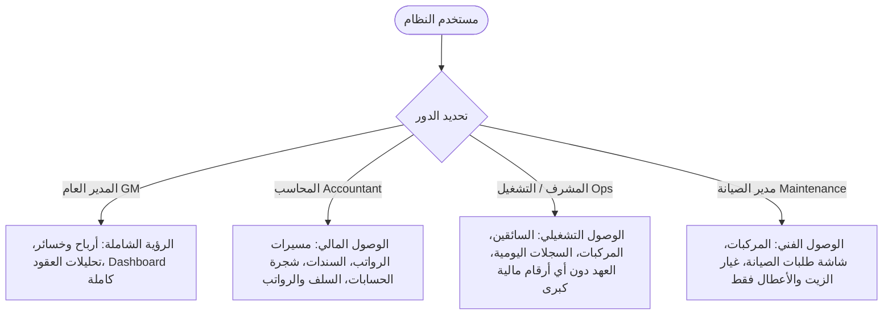

# وثيقة متطلبات النظام الشاملة بعد اجتماع مراجعة العميل (أبو عمر وأبو حضرم وفاتن)
# Comprehensive System Requirements Document & Architectural Blueprint (Post-Meeting Master Draft)

> [!IMPORTANT]
> تم إعداد هذه الوثيقة بناءً على إعادة قراءة تفصيلية ودقيقة لكامل تفريغ الاجتماع (`full metting.txt`) ومطابقته حرفياً مع احتياجات العميل (أبو عمر) والمشرفين والمديرة المالية (فاتن) والمحاسب (محمد). تم رصد كافة التفاصيل الدقيقة للأعطال البرمجية، وتصميم البنية التحتية، وهندسة الرواتب والمحاسبة، ونظام إدارة طلبات المتاجر والمطاعم، وتفصيل شاشات الخدمة الذاتية للسائقين عبر الواتساب لتكون المرجع الفني النهائي والأشمل للمطورين.

---

## جدول المحتويات | Table of Contents
1. [سجل الأخطاء والثغرات البرمجية المرصودة (Detailed Bug Log)](#1-سجل-الأخطاء-والثغرات-البرمجية-المرصودة-detailed-bug-log)
2. [تعديلات وتحسينات هيكلية تشغيلية (Operational Modifications & Refinement)](#2-تعديلات-وتحسينات-هيكلية-تشغيلية-operational-modifications--refinement)
3. [نظام احتساب الرواتب الثنائي وحركة الحسابات (Dual Payroll & Account Posting)](#3-نظام-احتساب-الرواتب-ثنائي-الطبقات-dual-payroll-architecture)
4. [ميزات تشغيلية ومالية جديدة بالكامل (New Features & Capabilities)](#4-ميزات-تشغيلية-ومالية-جديدة-بالكامل-new-features--capabilities)
5. [هيكلية الصلاحيات المخصصة (Roles & Permissions Architecture)](#5-هيكلية-الصلاحيات-المخصصة-roles--permissions-architecture)
6. [نظام إدارة وتوصيل الطلبات المدمج للمتاجر والمطاعم (OMS & Dispatching System)](#6-نظام-إدارة-وتوصيل-الطلبات-المدمج-للمتاجر-والمطاعم-oms--dispatching-system)
7. [هيكلية نظام الـ SaaS الثلاثي المطور وصلاحيات الاشتراكات (Advanced 3-Tier SaaS)](#7-هيكلية-نظام-الـ-saas-الثلاثي-المطور-وصلاحيات-الاشتراكات-advanced-3-tier-saas)
8. [رابط الخدمة الذاتية للسائق ومحفظته الرقمية (Driver Self-Service Portal & Digital Wallet)](#8-رابط-الخدمة-الذاتية-للسائق-ومحفظته-الرقمية-driver-self-service-portal--digital-wallet)
9. [الذكاء الاصطناعي في مطابقة ورفع ملفات الإكسل (AI-Powered Excel Import Mapper)](#9-الذكاء-الاصطناعي-في-مطابقة-ورفع-ملفات-الإكسل-ai-powered-excel-import-mapper)
10. [تفاصيل شجرة الحسابات الخفيفة والقيود اليدوية (Light ERP Ledger & Journal Entries)](#10-تفاصيل-شجرة-الحسابات-الخفيفة-والقيود-اليدوية-light-erp-ledger--journal-entries)
11. [حقل الإيراد المتوقع والتارغت على مستوى العقود (Contract Expected Revenue & Target)](#11-حقل-الإيراد-المتوقع-والتارغت-على-مستوى-العقود-contract-expected-revenue--target)
12. [نظام تنبيهات لوحة التحكم الذكية (Smart Dashboard Alerts & Period Comparison)](#12-نظام-تنبيهات-لوحة-التحكم-الذكية-وفترات-المقارنة-smart-dashboard-alerts--period-comparison)
13. [مركز التكلفة وتحميل المصاريف الإدارية (Cost Center Allocation for Supervisors)](#13-مركز-التكلفة-وتحميل-المصاريف-الإدارية-على-العقود-cost-center-allocation-for-supervisors)
14. [تحسينات موديول الصيانة (Maintenance Module Enhancements)](#14-تحسينات-موديول-الصيانة-maintenance-module-enhancements)
15. [طباعة سندات صرف واستلام الرواتب (Payroll Receipt Voucher Printing)](#15-طباعة-سندات-صرف-واستلام-الرواتب-payroll-receipt-voucher-printing)
16. [تنبيهات الواتساب وتحسين إدارة التكاليف (WhatsApp Alerts Cost Optimization)](#16-تنبيهات-الواتساب-وتحسين-إدارة-التكاليف-whatsapp-alerts-cost-optimization)
17. [نظام إدارة المهام الإدارية الداخلي (Internal Task Management System)](#17-نظام-إدارة-المهام-الإدارية-الداخلي-internal-task-management-system)

---

## 1. سجل الأخطاء والثغرات البرمجية المرصودة (Detailed Bug Log)

### 1.1. عطل عدم حفظ تغيير طريقة دفع راتب الموظف (Salary Payment Type Update Failure)
* **السياق في الاجتماع:** *"ولما يعمل تعديل على الراتب الثابت لطلب وحفظته يرجع ثاني ثابت، يعني ما ما يمسك التعديل، هلق نجربهم سوا."*
* **المشكلة البرمجية:** عند قيام المستخدم بتعديل "نوع احتساب الراتب" في ملف الموظف (تغيير الراتب من "ثابت شهري" إلى "عمولة بالطلب") وحفظ التعديلات، تفشل واجهة المستخدم الخلفية في تخزين التحديث بقاعدة البيانات، ليعود نوع الراتب إلى "ثابت" عند إعادة تحميل الصفحة.
* **الإجراء البرمجي المطلوب:** إصلاح دالة التحديث (Update Employee Controller) ومراجعة التحقق من المدخلات (Form Request Validation Rules) والتأكد من تحديث حقل `salary_type` بنجاح في جدول الموظفين.

### 1.2. عطل عدم حفظ تعديلات العقود أو إضافتها (Contract Save & Edit Reversion Bug)
* **السياق في الاجتماع:** *"والعقود إضافة ما يعني يرجع نفس ما هو، أيوا بالضبط... تعديل الراتب بالـ... والعقود إضافة ما يعني يرجع نفس ما هو."*
* **المشكلة البرمجية:** عند إضافة عقد جديد أو تعديل بيانات عقد قائم بالمنصة، لا يقوم النظام بالاحتفاظ بالتعديلات، حيث يظهر خطأ حفظ أو تعود البيانات تلقائياً لحالتها القديمة بعد إغلاق شاشة التعديل.
* **الإجراء البرمجي المطلوب:** مراجعة دوال الحفظ والتحديث لـ `ContractController` وإصلاح المعاملات (Transactions) والتأكد من استجابة قاعدة البيانات للـ `INSERT` و `UPDATE`.

### 1.3. عطل اختفاء قائمة السيارات عند التعيين (Vehicle Assignment Dropdown Load Failure)
* **السياق في الاجتماع:** *"بس التعيين ما عم تطلع السيارة... ما أدري شو مالها... إي بس عند اختيار لستة السيارات في بعض الأوقات ما بتظهر."*
* **المشكلة البرمجية:** تفشل قائمة السيارات (Dropdown List) في التحميل أو تظهر فارغة تماماً عند الرغبة في إسناد مركبة لسائق أو عند تسجيل طلب صيانة، على الرغم من وجود مركبات نشطة وغير مسندة بالنظام.
* **الإجراء البرمجي المطلوب:** فحص شروط الاستعلام (Queries Filters) وجلب السيارات من قاعدة البيانات، والتأكد من عدم وجود تداخل خاطئ مع شروط التصفية أو الحذف المؤقت (Soft Delete).

### 1.4. عطل فشل حفظ معلومات الموظف العامة (Employee Profile Edit Failure)
* **السياق في الاجتماع:** *"تعديل معلومات، معلومات الموظف. هي كانت ما تشتغل هادي كانت الـ... صح صح، امم."*
* **المشكلة البرمجية:** زر حفظ التعديلات في شاشة الموظفين (Employee Details Edit) لا يستجيب أو يفشل في تحديث الحقول المعدلة (مثل الاسم، ورقم الهاتف، والوثائق).
* **الإجراء البرمجي المطلوب:** مراجعة استجابة الـ Frontend ومطابقتها مع الـ Backend API Endpoint الخاص بتعديل الموظفين وإزالة أي تعارض بصلاحيات التعديل.

### 1.5. خلل وتداخل بيانات شاشة تسوية الكاش (Cash Settlement UI Misleading Logic)
* **السياق في الاجتماع:** *"طب أنا الحين أنا شو عرفني إنه هو عليه فلوس ولا لأ؟ المفروض إني أفتح تسويات الكاش يطلع لي الموجود المعلق واللي خالص... هاد تعريف انت لخبطك هاد."*
* **المشكلة البرمجية:** تعرض الشاشة الحالية لتسوية الكاش سجل الحركات التاريخية والتعريفات كجدول رئيسي، مما يسبب خلطاً كبيراً للمستخدم حول حالة السائق الحالية: هل سدد الكاش بالكامل أم لا يزال مديناً للنظام؟
* **الإجراء البرمجي المطلوب:** تعديل منطق الواجهة ليظهر جدول ملخص فوري يعرض فقط **مبالغ الكاش المجمعة المعلقة (Pending Cash Balance)** لكل سائق مع زر تسوية مباشر ومبسط بجانبه.

### 1.6. عطل عدم مزامنة وتحديث الرواتب بعد تعديل السجل اليومي (Daily Log Edit Sync Lock)
* **السياق في الاجتماع:** مناقشة مشكلة إدخال 600 طلب بالخطأ بدلاً من 550، وتعديله لاحقاً في شاشة السجلات اليومية دون أن ينعكس هذا التعديل في كشف الرواتب المحسوب مسبقاً.
* **المشكلة البرمجية:** بمجرد إنشاء أو احتساب مسير الرواتب الشهري، يقوم النظام بإغلاق البيانات (Sync Lock)، وفي حال حدوث تعديل تشغيلي بأثر رجعي في السجل اليومي، لا يتم إشعار المحاسب أو إعادة احتساب الرواتب ديناميكياً.
* **الإجراء البرمجي المطلوب:** بناء دالة مزامنة (Sync Trigger) تُنذر المحاسب بوجود تحديثات في السجلات اليومية تؤثر على الشهر المحسوب وتمنحه خيار "إعادة الاحتساب المالي" بضغطة زر.

### 1.7. عطل فشل وصول رسائل التحقق الخاصة بالواتساب (WhatsApp Meta Email Typo Bug)
* **السياق في الاجتماع:** *"شركة 'ميتا' ما عم تبعت مسجات.. ما وصل إيميل. آه المشكلة من dot co مكتوب مو dot com.. لقى هو هيك."*
* **المشكلة البرمجية:** خطأ إملائي في كتابة النطاق الخاص بإيميل التحقق من شركة ميتا وتدوينه بامتداد `.co` بدلاً من `.com` مما تسبب في إيقاف استلام كود التفعيل والربط.
* **الإجراء البرمجي المطلوب:** تعديل وتصحيح تكوين نطاقات البريد الإلكتروني والـ Webhooks الخاصة بربط خدمة WhatsApp Meta Business API.

---

## 2. تعديلات وتحسينات هيكلية تشغيلية (Operational Modifications & Refinement)

### 2.1. مراحل التوظيف الديناميكية (تحويل محلي vs. استقدام)
* **التعديل:** تخصيص خطوات إدخال وتوظيف الموظف بناءً على "نوع التوظيف":
  - **تحويل محلي (Local Transfer):** يكتفي النظام بطلب مستندات (كرت صحة، وإقامة/بطاقة مدنية).
  - **استقدام من الخارج (Hiring from Abroad):** يُضيف النظام خطوة رابعة إضافية في واجهة الإدخال تشمل تتبع مستندات: (الوصول، الفحص الطبي، إذن العمل، فحص القيادة ورخصة السوق).

### 2.2. تعديل فترة إشعارات انتهاء المستندات (Alert Threshold Modification)
* **التعديل:** تقليص فترة إرسال تنبيهات اقتراب انتهاء الوثائق الرسمية للمركبات والسائقين من **60 يوماً** إلى **30 يوماً** لتكون أكثر عملية وتمنع تكدس التنبيهات غير الطارئة بالواجهة.

### 2.3. إعادة تسمية "الضمانات" إلى "ملف وأرشيف السائق" (Driver's Scanned Archive)
* **التعديل:** تغيير مسمى موديول "الضمانات" في بروفايل الموظف إلى **"أرشيف السائق / ملف السائق"**.
* **الهدف:** توفير مستودع رقمي لرفع وحفظ المستندات الرسمية الممسوحة ضوئياً (جواز السفر، البطاقة المدنية، رخصة القيادة، عقد العمل، عقد زواج، المحاضر العدلية أو إثباتات الجرائم/السرقات بالعمل) ليعمل كـ File كامل لكل موظف.

### 2.4. تبسيط واجهة حقول السجل اليومي (Daily Log Simplification)
* **التعديل:** إخفاء حقول "طلبات كاش" و"طلبات أونلاين" لتجنب تعقيد الإدخال، والاستعاضة عنها بحقلين فقط:
  1. **عدد الطلبات الإجمالي (Orders Count).**
  2. **الكاش المجمع (Cash Collected):** إجمالي المبلغ النقدي المجمع فعلياً (د.ك).

### 2.5. تعديل مسمى الطلبات الإلكترونية (Payment Terminology Adjustment)
* **التعديل:** استبدال مسمى "طلبات أونلاين" بـ **"طلبات مدفوعة أونلاين / فيزا"** لتوضيح أن هذه الطلبات لا ينتج عنها مبالغ كاش يستلمها السائق بيده، وبالتالي لا تُحسب كـ "كاش معلق" بذمته.

### 2.6. آلية إرجاء وتأجيل سلف الموظفين (Postponing Loans Accounting Workaround)
* **المشكلة:** يطلب السائق أحياناً تأجيل قسط السلفة المستحق عليه هذا الشهر نظراً لظروفه المالية الصعبة.
* **المعالجة المحاسبية المعتمدة:** بدلاً من بناء منطق برمجيات معقد لتأجيل الأقساط، يتم معالجتها محاسبياً وقانونياً بشكل نظيف من خلال **إصدار سلفة جديدة مساوية للمبلغ المراد تأجيله** لهذا الشهر، وتوقيع السائق عليها، بحيث تقابل الخصم الحالي وتلغيه، ليتم ترحيل الخصم الفعلي للشهر القادم بشكل تراكمي سليم قانونياً.

### 2.7. تخصيص بنود العهد بالشركة (Covenants Customization)
* **التعديل:** إتاحة تخصيص أنواع العهد (عهد هواتف، عهد لابتوب، عهد سيارات) ديناميكياً من إعدادات الشركة وتجاوز القائمة الثابتة.

### 2.8. توفير محرك بحث وفلاتر متقدمة بجداول المنصة (Search & Advanced Filters)
* **التعديل:** إضافة شريط بحث وفلاتر ذكية في الجداول التالية:
  - **جدول المركبات:** البحث برقم اللوحة (KW / Plate Number).
  - **جدول الصيانة:** البحث برقم السيارة لمعرفة تاريخ صيانتها.
  - **جدول السجل اليومي:** إمكانية البحث والفلترة السريعة بناءً على: (اسم الموظف، المركبة، العقد، التاريخ كفلتر).

---

## 3. نظام احتساب الرواتب ثنائي الطبقات (Dual Payroll Architecture)

### 3.1. هيكلية الرواتب المزدوجة (Dual Salary Structure)
يمتلك كل سائق/موظف في النظام حقلين منفصلين للراتب:
1. **الراتب الرسمي للبنك (Official Bank Salary):** الراتب المسجل في عقد العمل الرسمي والذي يُحول إجبارياً للبنك.
2. **الراتب الفعلي للموظف (Actual/Effective Salary):** الراتب الحقيقي المتفق عليه تشغيلياً مع الموظف.

### 3.2. آلية الحسبة وتوزيع الخصومات والمخالفات
يتم احتساب الراتب الإجمالي والصافي الشهري بناءً على الحالات والمعادلات التالية:

* **إجمالي المستحقات الفعلية (Total Actual Earnings):**
  $$\text{إجمالي المستحقات} = \text{الراتب الفعلي} + \text{بونص الطلبات} (\text{عدد الطلبات} \times \text{عمولة الطلب}) + \text{البدلات} (\text{بدل وقود/أخرى})$$

* **إجمالي الخصومات (Total Deductions):**
  $$\text{إجمالي الخصومات} = \text{خصم الغياب والإجازات (الحسبة على 26 يوم)} + \text{الأقساط والسلف} + \text{المخالفات المرورية}$$

* **صافي المستحق الفعلي (Actual Net Pay):**
  $$\text{صافي المستحق الفعلي} = \text{إجمالي المستحقات الفعلية} - \text{إجمالي الخصومات}$$

### 3.3. قاعدة الفصل الصارم في الصرف (The Bank Payout Rule)
* **قاعدة البنك:** **صافي البنك (Official Bank Pay) يجب أن يُدفع بالكامل (مساوٍ للراتب الرسمي بالبنك) ولا يجوز خصم أي مخالفات أو سلف أو عهد منه أبداً.**
* **طريقة الصرف الفعلي:**
  - يتم تحويل مبلغ **صافي البنك** بالكامل عبر البنك للموظف.
  - يتم احتساب **الصافي الفعلي النقدي (Cash Payout)** الذي يستلمه الموظف يدوياً من الخزينة بالمعادلة التالية:
    $$\text{الصافي الفعلي النقدي} = \text{صافي المستحق الفعلي} - \text{صافي البنك}$$
  - **حالة الرواتب الأعلى بالبنك (الرصيد السالب):** إذا كان الراتب الرسمي بالبنك أعلى من الراتب الفعلي بعد الخصومات (مثال: راتب البنك 100 والراتب الفعلي 90)، يصبح الصافي النقدي سالباً (مما يعني أن الموظف استلم بالبنك أكثر من مستحقاته الفعلية)، ويتم ترحيل هذا الرصيد كمديونية على الموظف للشهر القادم أو تسويته محاسبياً.

---

## 4. ميزات تشغيلية ومالية جديدة بالكامل (New Features & Capabilities)

### 4.1. نظام إدارة المخالفات المرورية الذكي بالتاريخ (Traffic Violations Auto-Allocation)
1. يقوم مدخل البيانات بإدخال **رقم لوحة المركبة** وتاريخ المخالفة بالوقت واليوم (تاريخ المخالفة حقل إلزامي).
2. يقوم النظام تلقائياً بالبحث في سجلات الحركة التاريخية للسيارة لمعرفة السائق الذي كانت السيارة بعهدته في ذلك التاريخ والوقت المحددين.
3. يتم إسناد المخالفة تلقائياً لبروفايل هذا السائق وخصم قيمتها من راتبه الفعلي النقدي.
4. **حالة عدم المزامنة (Missing Data / No Match):** إذا لم يجد النظام أي سائق مسند للمركبة في ذلك التاريخ (بسبب نقص في البيانات التاريخية)، يقوم النظام بتنبيه المستخدم وإتاحة خيارين:
   - إسناد المخالفة يدوياً لسائق معين من القائمة المنسدلة.
   - تسجيل المخالفة **"على الشركة"** لتتحملها الشركة مالياً.
5. دعم رفع صور إثبات المخالفة مباشرة للنظام للتوثيق بدلاً من الاقتصار على الروابط الخارجية.

### 4.2. تتبع قراءات العداد وتنبيهات غيار الزيت التلقائية (Odometer & Oil Change Alerts)
* يلتزم السائق يومياً بإدخال قراءة عداد السيارة: **عداد البداية (Start Odometer)** و**عداد النهاية (End Odometer)** في السجل اليومي.
* يقوم النظام باحتساب المسافات المقطوعة تلقائياً وتراكمها.
* **تنبيه غيار الزيت:** عند وصول المسافة التراكمية المقطوعة إلى **4000 كم** (أو القيمة المخصصة للسيارة)، يُطلق النظام تنبيهاً ذكياً أحمر بضرورة تغيير الزيت للمركبة فوراً.
* **صورة العداد (Odometer Verification):** إلزام السائق بالتقاط صورة حية لعداد السيارة ورفعها عبر النظام لتفادي التلاعب بالعدادات والمسافات المقطوعة.

### 4.3. نظام تسليم واستلام السيارات وعقود العهدة الرقمية (Vehicle Handover Protocol)
* عند رغبة المشرف في تسليم سيارة لسائق جديد، يتم تفعيل بروتوكول تسليم المركبة (شبيه بمكاتب تأجير السيارات).
* يقوم النظام بإنشاء عقد عهدة وتسليم سيارة إلكتروني قابل للطباعة والتوقيع اليدوي من السائق.
* يلتزم المشرف بتصوير السيارة من 4 جهات لإثبات حالتها الفنية والخدوش ورفع الصور مباشرة وربطها بعقد التسليم.
* يتم حفظ عقد التسليم الموقع وصور حالة السيارة في بروفايل السائق بشكل دائم لحماية حقوق الشركة.

### 4.4. التارغت الديناميكي وتدرج أسعار الطلبات للسائقين (Driver Target Dynamic Pricing)
* تحديد تارغت طلبات شهري للسائق (مثال: 400 طلب بالشهري).
* يتم ربط عمولة الطلب بالتارغت بطريقة ثنائية وحافزة:
  - **أقل من التارغت (Under Target):** يُحسب سعر الطلب الواحد عمولة منخفضة (مثال: 0.250 د.ك).
  - **عند/فوق التارغت (At/Over Target):** يرتفع سعر كافة طلبات السائق المحققة تلقائياً إلى عمولة أعلى (مثال: 0.500 د.ك) لتشجيعه على الإنتاجية وتكريم جهوده.

### 4.5. المطابقة التلقائية لنهاية الشهر (Auto-Matching Reconciliation System)
* ميزة ذكية تتيح للمشرفين رفع ملف إكسل النهائي المعتمد للطلبات المرسل من الشركات المتعاقدة (مثل طلبات، كيتا، إلخ)، ليقوم النظام تلقائياً بمطابقة الفواتير والطلبات مع السجلات المدخلة من السائقين والعمليات وتحديد الفروقات المباشرة وتصحيحها قبل إصدار الرواتب.

---

## 5. هيكلية الصلاحيات المخصصة (Roles & Permissions Architecture)

تتوزع الصلاحيات بصرامة في النظام لتأمين خصوصية البيانات المالية ومنع الأخطاء التشغيلية:

---

## 6. نظام إدارة وتوصيل الطلبات المدمج للمتاجر والمطاعم (OMS & Dispatching System)

طلب العميل إمكانية بيع وتكويف النظام ليعمل أيضاً كـ **نظام إدارة وتوزيع طلبات (Order Management System - OMS)** متكامل ومخصص للمطاعم والمحلات التجارية التي تمتلك أسطول توصيل خاص أو خارجي:

### 6.1. واجهة استقبال وتجميع الطلبات الموحدة (All-in-One Orders Panel)
* **استقبال الطلبات اليدوي (Manual Orders Entry):** إمكانية إدخال طلبات دليفري يدوياً عن طريق الهاتف (عنوان العميل، رقم الهاتف، اسم المنتج/الوجبة، نوع الدفع كاش/رابط، وتكلفة التوصيل).
* **الربط البرمجي التلقائي (Automated API Integration):** واجهة API موحدة للربط مع منصات التجارة الإلكترونية وشركات الطلبات (مثل Shopify, موفو Movo, بي أوردر Beeorder, يلا غو Yallago). 
* **Payload API الموحد:** يحتوي على تفاصيل العميل، الموقع الجغرافي، الوجبات/المنتجات، جهة الطلب الأصلية، قيمة الكاش المطلوب تحصيله، وحالة الدفع الإلكتروني.

### 6.2. بروسس وحالات توزيع الطلبات التشغيلية (Dispatching Workflow States)
1. **طلب جديد (New Order):** يصل الطلب للنظام أوتوماتيكياً أو يدوياً ويكون باللون الأزرق.
2. **جاري التحضير (Preparing):** يدخل المطبخ/المستودع للتعبئة والتجهيز.
3. **جاهز للتوصيل (Ready for Dispatch):** يطلق إشعاراً للمشغل لإسناده لأقرب سائق متاح.
4. **جاري التوصيل (Delivering):** يتم إسناد الطلب للسائق (مثال: عماد)، وتتغير الحالة ويتحرك العداد الذكي للوقت.
5. **تم التوصيل (Delivered) / ملغي (Cancelled):** تسوية ذمة الكاش أو إرجاع الطلب للمخزن.

---

## 7. هيكلية نظام الـ SaaS الثلاثي المطور وصلاحيات الاشتراكات (Advanced 3-Tier SaaS)

بناءً على رغبة أبو عمر في بيع النظام كـ SaaS مستقل ومحمي الخصوصية للشركات الكبرى، يتم اعتماد البنية المعمارية التالية:

### 7.1. المستويات الثلاثة لإدارة النظام (Three-Tier Hierarchy)
1. **السوبر سوبر أدمن (Super Super Admin - منصة مرسال):** المالك العام للبرمجية ولديه لوحة تحكم شاملة للتحكم بجميع اشتراكات العملاء والفوترة ومراقبة أداء المنصة الإجمالي.
2. **سوبر أدمن العميل المتعدد الشركات (Tenant Client Super Admin):** حساب خاص لعميل كبير (مثل أبو عمر) يتيح له إدارة جميع شركاته الفرعية التابعة له فقط (مثل شركة البراق، شركة النسر، شركة أسبيكت) في لوحة تجميعية موحدة للتحليلات التشغيلية وربحية العقود، مع الحفاظ على عزل بياناته بالكامل عن بقية عملاء المنصة.
3. **مدير الشركة الفرعية (Company Admin):** حساب مخصص لمدير شركة واحدة فقط (مثل الآنسة فاتن لشركة البراق) لمتابعة العمليات اليومية والصيانة والرواتب دون القدرة على رؤية بيانات الشركات الأخرى التابعة لنفس المالك.

### 7.2. درجات التحكم في الاشتراكات (Subscription Status Degrees)
* **نشط (Active):** وصول كامل للوحدات والعمليات والتقارير.
* **معطل (Blocked/Inactive):** حظر دخول للمنصة نهائياً مع حفظ كامل البيانات بقاعدة البيانات.
* **عرض فقط (View-Only / للقراءة فقط):** ميزة أمانة مبتكرة للعملاء المنتهية اشتراكاتهم، تتيح لهم الدخول وتصفح حساباتهم وسجلات حلالهم التاريخية كاملة، ولكن مع تعطيل أزرار الحفظ والإضافة تماماً (Read-Only Mode).

---

## 8. رابط الخدمة الذاتية للسائق ومحفظته الرقمية (Driver Self-Service Portal & Digital Wallet)

لتسهيل إدخال البيانات اليومية وتجنب تشتيت السائقين، يتم إلغاء تطبيق الجوال المعقد والاستعاضة عنه بنظام الروابط الذكية السلسة:

### 8.1. رابط الإدخال اليومي الذاتي عبر الواتساب (Secure WhatsApp Self-Service Link)
* يقوم النظام بإنشاء **رابط مشفر ومرتبط بتوكن زمني فريد (Unique Tokenized Link)** لكل سائق.
* يرسل المشرف هذا الرابط للسائق تلقائياً عبر الواتساب يومياً.
* عند ضغط السائق على الرابط، تفتح له صفحة ويب بسيطة متوافقة تماماً مع الجوال ولا تتطلب تسجيل دخول، وتظهر له الحقول التالية فقط:
  1. قراءة عداد البداية والنهاية (Start & End Odometer).
  2. زر التقاط ورفع صورة العداد الحية (Odometer Picture Upload).
  3. حقل إدخال إجمالي عدد الطلبات اليومية (Orders Count).
  4. حقل الكاش الفعلي المجمع بيده (Cash Collected).
  5. اختيار العقد الحالي الذي عمل عليه (Contract Selection).

### 8.2. المحفظة الرقمية للسائق (Driver's Personal Digital Wallet Dashboard)
* تحتوي صفحة السائق الذاتية على تبويب **"محفظتي الرقمية"** لعرض الشفافية المالية الفورية له:
  - إجمالي إيراداته وبونص الطلبات المحقق للشهر الحالي.
  - تفاصيل الخصومات المقتطعة (المخالفات المرورية والسلف).
  - صافي مستحقاته المتوقع صرفها يدوياً كـ (كاش نقدي) وصافي ما سيحول لحسابه البنكي.
  - إخطاره الفوري عند إسناد أي مخالفة مرورية جديدة لملفه لضمان العدالة وعدم مراجعة الإدارة بجدل.

---

## 9. الذكاء الاصطناعي في مطابقة ورفع ملفات الإكسل (AI-Powered Excel Import Mapper)

بناءً على طلب العميل بالمرونة المطلقة لرفع ملفات إكسل التاريخية للموظفين والسيارات من سيستم الشامل أو ملفات قديمة دون التقيد بقوالب برمجية صارمة قد تتغير وتتسبب في انهيار النظام:

### 9.1. محرك المطابقة المرن (Flexible Excel Parser)
* يوفر النظام قالب إكسل افتراضي (Standard Excel Template) كخيار أساسي وسهل.
* **مستورد الإكسل المرن:** عند قيام المستخدم برفع أي ملف إكسل بتنسيق مختلف، يقوم النظام باستعراض كافة أعمدة الملف المرفوع يدوياً ومطابقتها بصرياً مع الحقول المطلوبة بالنظام (مثل: تطابق عمود "رقم لوحة المركبة" في إكسل مع حقل "Plate Number" بالنظام).

### 9.2. المساعد الذكي بالذكاء الاصطناعي (AI-Assisted Mapping Hook)
* دمج محرك AI خفيف يقوم بتحليل محتويات ومسميات أعمدة ملف الإكسل المرفوع أوتوماتيكياً ومطابقتها ذكياً مع الأعمدة المقابلة بقاعدة بيانات النظام، حتى لو كانت التسميات مختلفة (مثال: ربط "تلفون المندوب" بـ "driver_phone" تلقائياً).
* يتم تقديم الخدمة كباقة وميزة تشغيلية إضافية مدفوعة الأجر (Paid Feature Add-on) للشركات الكبيرة التي ترغب في ترحيل بياناتها الضخمة فوراً دون إدخال يدوي.

---

## 10. تفاصيل شجرة الحسابات الخفيفة والقيود اليدوية (Light ERP Ledger & Journal Entries)

اتفق العميل مع المحاسب (محمد) والمديرة المالية (فاتن) على الاستغناء بالكامل عن شجرة حسابات ضخمة مثل ERP Next أو Odoo وتوفير بديل مبسط يعوضهم 100% عن برنامج "الشامل" المعمول به حالياً بنسبة 10% فقط من قدراته المالية:

### 10.1. دليل شجرة الحسابات المرن (Flexible Chart of Accounts - COA)
* توفير شجرة حسابات قياسية مبسطة تحتوي على الجذور الأربعة الكبرى:
  - **الأصول (Assets):** ويندرج تحتها (حساب البنك، حساب الصندوق، ذمم العملاء/الشركات المتعاقدة مثل طلبات وكيتا).
  - **الخصوم والالتزامات (Liabilities):** ويندرج تحتها (ذمم السائقين المعلقة، أقساط وسلف الموظفين).
  - **الإيرادات (Revenues):** ويندرج تحتها (إيرادات عقود التوصيل، الإيرادات المتنوعة).
  - **المصاريف (Expenses):** ويندرج تحتها (رواتب الموظفين الإداريين، رواتب السائقين التشغيلية، مصاريف الصيانة والوقود، المخالفات المرورية المسجلة على الشركة).
* إتاحة إضافة أي بند مصروفات أو حساب فرعي ديناميكياً بواسطة المحاسب يدوياً دون قيود برمجية صارمة.

### 10.2. نظام القيود اليومية اليدوي ودفتر الأستاذ (Manual Journal Entries & General Ledger)
* **دفتـر القيـود اليوميـة (Journal Entry Builder):** شاشة إدخال بسيطة تتيح للمحاسب تدوين القيود المحاسبية اليدوية التقليدية المزدوجة (دائن ومدين - Debit & Credit) مثل:
  * *مثال صرف الرواتب:* `من حساب رواتب وأجور السائقين (مدين) إلى حساب البنك (دائن)`.
  * *مثال تحصيل مستحقات العقود:* `من حساب البنك (مدين) إلى حساب ذمم شركة طلبات (دائن)`.
* **كشف حساب الأستاذ العام (Statement of Account):** محرك بحث وفلترة فوري يتيح للمحاسب كتابة اسم أي حساب (مثل البنك أو الصندوق أو بروفايل سائق معين) واستخراج كشف حساب مالي تفصيلي دقيق ومطابق لواقع المعاملات اليدوية والآلية، مع خيار التصدير المباشر لملفات إكسل و PDF.
* **ميزان المراجعة والحسابات الختامية:** تقارير مالية مبسطة تصدر تلقائياً بناءً على القيود المرحلة، وتظهر أرباح وخسائر الشركة الإجمالية ونشاطها المالي المباشر.

---

## 11. حقل الإيراد المتوقع والتارغت على مستوى العقود (Contract Expected Revenue & Target)

* **السياق:** *"إذا وقعت عقداً مع شركة يلا غو ووفرت لهم 20 سيارة، والمفترض أن تجلب لي السيارة الواحدة إيراداً بقيمة 1000 دولار من هذا العقد، فإن إجمالي الإيراد المتوقع هو 20,000 دولار."*
* **المطلوب:** إضافة حقلين جديدين في واجهة العقد:
  1. **الإيراد المتوقع (Expected Revenue):** المبلغ الشهري المتوقع تحصيله من هذا العقد.
  2. **عدد السائقين المخصصين (Assigned Drivers Count):** عدد السائقين/المركبات المرصودة لهذا العقد.
* يتم مقارنة الإيراد الفعلي بالإيراد المتوقع في تقارير ربحية العقود، وإظهار تنبيه أحمر عند انخفاض الأداء عن المتوسط.

---

## 12. نظام تنبيهات لوحة التحكم الذكية وفترات المقارنة (Smart Dashboard Alerts & Period Comparison)

* **السياق:** *"أحتاج إلى نظام تنبيهات ذكي في لوحة التحكم يخطرني فوراً عند حدوث أي انخفاض في أداء العقود."*
* **المطلوب:**
  - تنبيهات أداء العقود في الداشبورد بناءً على مقارنة الإيراد الفعلي بالإيراد المتوقع.
  - فترات المقارنة التحليلية المتاحة: **يومية، أسبوعية، شهرية، ربع سنوية، وسنوية**.
  - لوحة التحكم يجب أن تختلف بحسب الدور:
    - **المدير العام:** يرى ربحية العقود، الأرباح والخسائر، والوضع التشغيلي الكامل.
    - **المحاسب:** يرى التدفقات النقدية والمصاريف والرواتب.
    - **المشرف/التشغيل:** يرى السائقين والطلبات والعقود تحت إشرافه فقط.

---

## 13. مركز التكلفة وتحميل المصاريف الإدارية على العقود (Cost Center Allocation for Supervisors)

* **السياق:** *"موظف بمهام Supervisor يمكن تحديد مركز التكلفة الخاص به ليُحمّل على عقد معين مثل عقد كيتا. وإذا كان الموظف يعمل على أكثر من عقد، يتم توزيع تكلفته بالتساوي أو بنسب محددة بين العقود."*
* **المطلوب:**
  - إضافة حقل **مركز التكلفة (Cost Center)** لكل موظف إداري/مشرف، يربطه بعقد واحد أو أكثر.
  - إذا كان المشرف مسؤولاً عن عقد واحد: تُحمّل تكلفته كاملة على هذا العقد.
  - إذا كان مسؤولاً عن أكثر من عقد: تُوزع تكلفته بالتساوي أو بنسب يحددها المدير.
  - يظهر أثر التحميل في تقارير ربحية العقود ضمن بند **المصاريف التشغيلية (Operational Expenses)**.

---

## 14. تحسينات موديول الصيانة (Maintenance Module Enhancements)

* **السياق:** *"تسجيل مدة الصيانة المتوقعة لكل سيارة عند دخولها الكراج مثلاً 3 أيام، وإرسال تنبيه تلقائي في حال تأخر خروج السيارة عن الموعد المحدّد."*
* **المطلوب:**
  1. **مدة الصيانة المتوقعة (Expected Maintenance Duration):** حقل جديد عند إدخال طلب صيانة لتحديد عدد الأيام المتوقعة.
  2. **تنبيه تأخر الصيانة:** إشعار تلقائي أحمر عند تجاوز السيارة للمدة المتوقعة داخل الكراج.
  3. **إجمالي مبالغ الصيانة الشهرية:** تقرير مالي مجمع لمصاريف الصيانة.
  4. **أكثر السيارات دخولاً للصيانة:** ترتيب المركبات بناءً على تكرار أعطالها.
  5. **الأعطال المتكررة:** تحليل أنواع الأعطال الأكثر شيوعاً.
  6. **تقييم الكراجات (Garage Rating):** تقييم ورش الصيانة المتعاقد معها بناءً على الجودة والوقت والتكلفة.

---

## 15. طباعة سندات صرف واستلام الرواتب (Payroll Receipt Voucher Printing)

* **السياق:** *"نحتاج إلى إمكانية طباعة سند استلام راتب (سند صرف) يوقع عليه الموظف أو السائق يدوياً عند استلام راتبه نقداً، لحفظ حقوق الشركة."*
* **المطلوب:**
  - توفير زر **طباعة سند صرف/استلام** لكل موظف في كشف الرواتب الشهري.
  - السند المطبوع يتضمن: اسم الموظف، الراتب الأساسي، البونص، الخصومات، صافي البنك، صافي الكاش، وخانة توقيع الاستلام.
  - فصل واضح بين صافي البنك وصافي الكاش في السند المطبوع.

---

## 16. تنبيهات الواتساب وتحسين إدارة التكاليف (WhatsApp Alerts Cost Optimization)

* **السياق:** *"يجب الأخذ في الحسبان أن رسائل الواتساب لها تكلفة مالية متغيرة وتُحسب بالرسالة من قبل شركة Meta."*
* **المطلوب:**
  - تفعيل تنبيهات واتساب للأمور الحرجة فقط: (كاش معلق على السائق، اقتراب انتهاء وثائق/رخص، مخالفة مرورية جديدة).
  - تقنين التنبيهات لتجنب التكاليف الباهظة مع Meta.
  - **خيار مستقبلي:** بناء تطبيق جوال بسيط لإرسال Push Notifications المجانية كبديل اقتصادي.

---

## 17. نظام إدارة المهام الإدارية الداخلي (Internal Task Management System)

* **السياق:** *"هل يمكننا إضافة نظام إدارة مهام داخلي مبسط؟ بحيث يستطيع المدير العام أو مدير التشغيل إنشاء مهمة وتعيينها لموظف إداري أو مشرف معين."*
* **المطلوب:**
  - إضافة موديول **إدارة المهام (Task Management)** داخل النظام.
  - إمكانية إنشاء مهمة بعنوان ووصف وتاريخ استحقاق.
  - تعيين المهمة لموظف إداري أو مشرف محدد.
  - تنبيه الموظف المعين بالمهمة الجديدة.
  - متابعة نسبة الإنجاز وحالة المهمة (جديدة، قيد التنفيذ، مكتملة).

---

> [!TIP]
> يمثل هذا المستند العقد الفني والتشغيلي النهائي المتوافق مع كامل طموحات العميل ونقاشاته، ويجب الالتزام المطلق ببنائه البرمجي في مسارات العمل القادمة لضمان تسليم منصة تثير ذهول وإعجاب العميل وتقدم له قيمة تجارية غير مسبوقة.
