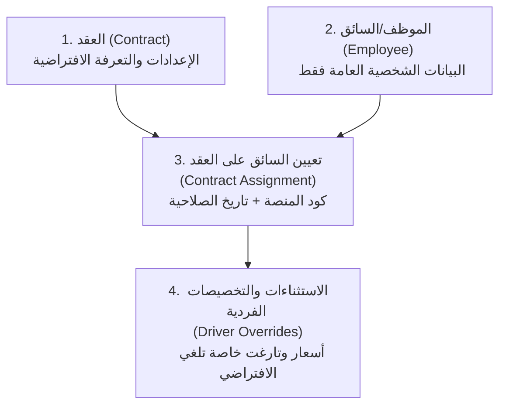

# 📋 سيناريو ربط السائق بالعقد وآليات الاحتساب المالي (FleetOps Contract Scenario)

يوضح هذا المستند السيناريو العملي المنظم لربط السائق بالعقد وطريقة احتساب المستحقات المالية بناءً على المستويات الثلاثة في النظام وبأرقام دقيقة وأمثلة تشغيلية واقعية.

---

## 🏛️ المستويات الثلاثة الأساسية للنظام



---

## أولاً: إضافة العقد (Contract Entry)

### 1. بيانات العقد الأساسية
عند إنشاء العقد يتم إدخال المعلومات القانونية والتشغيلية العامة:
*   **اسم العقد:** عقد دليفرو الرئيسي (Deliveroo KWD)
*   **اسم العميل:** Deliveroo Kuwait
*   **تاريخ البدء:** `01-01-2026` | **تاريخ الانتهاء:** `31-12-2026`
*   **الحالة:** نشط (Active)
*   **العملة الأساسية:** دينار كويتي (KWD)
*   **المشرف المسؤول:** أحمد الشمري (Project Manager)

### 2. إعدادات الاحتساب للعقد (Calculation Settings)
يتم تحديد طريقة الحساب والتعرفة الافتراضية لهذا العقد:
*   **نوع الدفع والتشغيل:** حسب الطلب (Per Order)
*   **نوع مصدر البيانات:** البيانات اليومية نهائية (Daily Logs are Final)
*   **سعر الطلب الافتراضي:** `0.300 KWD` (300 فلس لكل طلب)
*   **التارغت الشهري الافتراضي:** `300` طلب شهرياً.

### 3. إعدادات التارغت ومؤشرات الأداء (Target & KPI)
*   **عدد السائقين المطلوب تشغيلهم:** `20` سائق.
*   **الإيراد المتوقع شهرياً:** `4,500 KWD` (بافتراض تحقيق 15,000 طلب للعقد ككل).
*   **المصاريف التشغيلية المتوقعة:** `3,200 KWD` (رواتب سائقين وبنزين).
*   **هامش الربح المستهدف:** `28%`.

---

## ثانياً: إضافة الموظف / السائق (Employee Profile)
يتم تسجيل السائق ببياناته الشخصية والإدارية العامة فقط **(دون وضع عمولات أو رواتب أو تارغت في ملفه الشخصي)**:
*   **اسم الموظف:** أحمد مصطفى
*   **الرقم المدني:** `295081201982`
*   **رقم الهاتف:** `96599008811`
*   **نوع الموظف:** سائق (Driver)
*   **حالة الموظف:** فعّال (Active)
*   **رقم رخصة القيادة:** `DL-998822` | **تاريخ انتهاء الرخصة:** `15-12-2028`

---

## ثالثاً: تعيين السائق على العقد (Contract Assignment)
يتم عمل سجل تعيين رسمي لربط السائق أحمد مصطفى بعقد دليفرو:
*   **السائق:** أحمد مصطفى
*   **العقد المربوط:** عقد دليفرو الرئيسي (Deliveroo KWD)
*   **تاريخ بداية العمل على العقد:** `01-06-2026`
*   **تاريخ النهاية:** يُترك فارغاً (Nullable) طالما السائق مستمر بالعمل.
*   **حالة التعيين:** نشط (Active)
*   **كود السائق في المنصة (Courier ID):** `DELV-4492`

---

## رابعاً: أولوية الاحتساب (Priority Stack)

يحتسب المحاسب المالي المستحقات بالترتيب التنازلي التالي:

| الأولوية | مستوى الاحتساب | آلية التطبيق |
| :---: | :--- | :--- |
| **1** | **تخصيصات السائق الخاصة (Overrides)** | إذا وجد النظام أي سعر أو تارغت مدخل في تخصيصات السائق للتعيين في تاريخ العمل، يتم اعتماده فوراً. |
| **2** | **إعدادات العقد الافتراضية (Contract Defaults)** | في حال عدم وجود تخصيص، يطبق النظام أسعار العقد الافتراضية (مثال: 300 فلس للطلب). |
| **3** | **إعدادات الشركة العامة (Company Settings)** | في حال عدم وجود أي إعداد في العقد، يرجع النظام للثوابت العامة للشركة. |

---

## 💡 حالات عملية وأمثلة حركية بالأرقام الدقيقة

### 📊 الحالة العملية 1: السائق (أحمد) - يطبق إعدادات العقد الافتراضية
*   **بيانات التعيين:** السائق أحمد مصطفى معين على عقد دليفرو. **(لا توجد له أي تخصيصات خاصة/أسعار خاصة)**.
*   **سجل العمل لشهر يونيو:**
    *   إجمالي عدد الطلبات المنجزة بملف التشغيل اليومي: `350` طلب.
*   **الاحتساب المالي:**
    1. يتحقق النظام من تخصيصات السائق أحمد $\rightarrow$ لا يوجد.
    2. يتراجع النظام لأسعار العقد الافتراضية $\rightarrow$ سعر الطلب = `0.300 KWD`.
    3. المعادلة الحسابية:
       $$\text{إجمالي المستحق} = 350 \text{ (طلب)} \times 0.300 \text{ (دينار)} = 105.000\text{ KWD}$$

---

### 📊 الحالة العملية 2: السائق (محمد) - لديه تخصيصات وأسعار خاصة (Driver Overrides)
*   **بيانات التعيين:** السائق محمد جاسم معين على عقد دليفرو.
*   **التخصيص الفردي المدخل لمحمد (Driver Override):**
    *   **سعر الطلب الخاص:** `0.400 KWD` (400 فلس بدلاً من 300).
    *   **التارغت الخاص:** `220` طلب (بدلاً من 300).
    *   **تاريخ سريان التخصيص:** من `01-06-2026` إلى `30-06-2026` (شهر يونيو فقط).
    *   **سبب التخصيص:** "سائق متميز تم نقله مؤقتاً لتغطية نقص تشغيلي".
*   **سجل العمل لشهر يونيو:**
    *   إجمالي عدد الطلبات المنجزة بملف التشغيل اليومي: `250` طلب.
*   **الاحتساب المالي:**
    1. يتحقق النظام من تخصيصات محمد لشهر يونيو $\rightarrow$ يوجد سعر طلب خاص (`0.400 KWD`).
    2. يلغي النظام السعر الافتراضي للعقد ويطبق السعر المخصص مباشرة.
    3. المعادلة الحسابية:
       $$\text{إجمالي المستحق} = 250 \text{ (طلب)} \times 0.400 \text{ (دينار)} = 100.000\text{ KWD}$$
       *(ملاحظة: تحقق التارغت الخاص لمحمد لأنه أنجز 250 طلباً وهو أكبر من التارغت المخصص له 220 طلب).*

---

### 📊 الحالة العملية 3: عقد كيتا (Keeta) - عقد هجين معقد VDA
*   **إعدادات العقد (العقد بـ Deliveroo / Keeta Hybrid):**
    *   **نوع الدفع:** هجين (Hybrid)
    *   **مصدر البيانات:** ملف تسوية شهري (Requires Monthly Excel File)
    *   **الراتب الأساسي الثابت الافتراضي:** `150.000 KWD`
    *   **الحد الأدنى لأيام الحضور المطلوبة:** `26` يوماً.
    *   **سعر الطلب الإضافي الافتراضي:** `0.100 KWD` (100 فلس للطلب).
    *   **معايير الصلاحية (VDA Core Targets):**
        *   تارغت كفاءة الحضور المطلوبة: `26` يوماً.
        *   تارغت الطلبات الشهري: `400` طلب.
*   **حوافز السعة (Capacity Incentives):**
    *   تحقيق سعة مشروع المستوى A (+50.000 KWD).
    *   تحقيق سعة مشروع المستوى B (+30.000 KWD).
*   **حوافز الخبرة (Experience Tiers):**
    *   **الخبرة فئة A (إنجاز $\ge 495$ طلب):** عمولة بونص إضافية قدرها `0.150 KWD` لكل طلب.
    *   **الخبرة فئة B (إنجاز $385$ إلى $494$ طلب):** عمولة بونص إضافية قدرها `0.100 KWD` لكل طلب.

#### 📝 سيناريو الحساب للسائق (علي):
*   **بيانات التشغيل الفعلية بنهاية الشهر (حسب تقرير كيتا المستورد):**
    *   عدد أيام الحضور الفعلية: `27` يوماً (حقّق شرط الـ 26 يوماً).
    *   عدد الطلبات الفعلي: `420` طلب.
    *   سعة المشروع للشهر تم اعتمادها بمستوى **Level B**.
    *   حالة السائق الشهرية النهائية: **صالح (Valid)**.
*   **تفصيل الحساب المالي:**
    1.  **الراتب الأساسي:** يستحق الراتب كاملاً لعدم وجود غيابات = `150.000 KWD`.
    2.  **عمولة الطلبات العادية:**
        $$420 \text{ (طلب)} \times 0.100 \text{ (دينار)} = 42.000\text{ KWD}$$
    3.  **حافز السعة (Level B):** يستحق بونص إضافي = `30.000 KWD`.
    4.  **حافز الخبرة (فئة B لأن طلباته 420 تقع في النطاق 385-494):**
        $$420 \text{ (طلب)} \times 0.100 \text{ (بونص)} = 42.000\text{ KWD}$$
    5.  **المجموع الكلي للمستحقات (Actual Gross):**
        $$150.000 + 42.000 + 30.000 + 42.000 = 264.000\text{ KWD}$$
    6.  **الخصومات (Deductions):**
        *   تم تسجيل مخالفة مرورية على علي بقيمة `10.000 KWD` ويتحملها السائق بالكامل.
    7.  **صافي الراتب النهائي الكاش (Net Actual Pay):**
        $$264.000 - 10.000 = 254.000\text{ KWD}$$

---

## 📈 أثر العمليات على التقارير المالية والربحية

بمجرد ربط السائق وتأكيد البيانات، تتأثر مخرجات التقارير والربحية تلقائياً كالتالي:

```mermaid
linechart
    title "ربحية عقد دليفرو - يونيو 2026 (KWD)"
    "إيرادات العقد" : 4500
    "تكلفة السائقين المباشرة" : 2100
    "مصاريف السيارات والوقود" : 600
    "حصص الصيانة والحوادث" : 200
    "صافي ربح العقد" : 1600
```

*   **عند إدخال الطلب اليومي:** يرتفع إيراد العقد (عدد الطلبات × قيمة سعر خدمة العميل)، ويرتفع مستحق السائق كتكلفة مباشرة على العقد.
*   **عند تسجيل مخالفة/حادث:** إذا كان الخطأ من السائق; يخصم من راتب السائق وتتأثر ربحية مركبته. وإذا كانت الشركة تتحمل الحادث; تُقيد التكلفة كمصروف مباشر على العقد مما يقلل من صافي ربح العقد الإجمالي في لوحة تحكم ربحية العقود.
